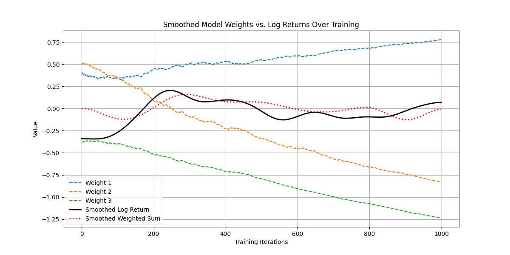

Implemented a small fully connected neural network from scratch without machine learning frameworks to classify positive or negative logarithmic returns of an asset.
Challenged to use TanH as an activation function from this YouTube series: [Video Inspiration](https://www.youtube.com/watch?v=Vx9uy_iAo-A&list=PLaXsBdJZLRmXC1uFWqh7l_q-468vq-tDq&index=6)

Smooth function estimation after 1000 epochs

Mean accuracy test after 6000 epochs

